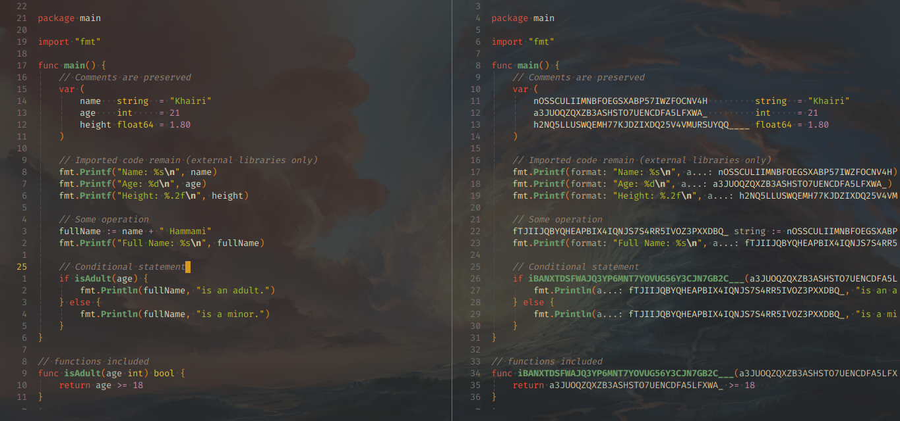

# SourceFuck - The Ultimate Code Obfuscation Tool

SourceFuck is a command-line tool that provides powerful code obfuscation capabilities, allowing you to make your code completely unintelligible while maintaining its functionality. It offers a seamless solution for obfuscating your code, ensuring that it becomes extremely challenging for others to understand.



## Features

- Code obfuscation: SourceFuck encrypts your code, making it unreadable to others.
- Preserves functionality: Despite the encryption, your code will still run perfectly fine.
- Multiple directory support: Encrypt entire directories of code, increasing the level of confusion.
- Easy usage: Simple and straightforward to use on your projects.
- Future expansion: Stay tuned for updates as I plan to support additional programming languages.

## Installation

To install SourceFuck, you need to have Go installed on your system. Then, run this command:

```bash
go install github.com/hammamikhairi/sourcefuck@latest
```

## Usage

To obfuscate or decrypt your code using SourceFuck, use the following command:

```bash
sourcefuck --path [path/to/your/code] --ext [file_extension] --key [encryption_key] [--out [output_directory]] [--dec]
```

* `--path` : Specifies the path to your file or directory that you want to obfuscate or decrypt.
* `--ext` : (Optional for directories) Specifies the file extension of the targeted files within the directory (only `go` is supported now but will add more languages in future versions).
* `--key` : Specifies the encryption/decryption key. The default key is 8 if not specified. The current encryption method used is the Caesar cipher. Future versions of SourceFuck will incorporate a more advanced encryption algorithm.
* `--out` : (Optional) Specifies the output directory for the obfuscated or decrypted code. If not provided, the encrypted/decrypted code will be written to either [path/to/your/code]/Dec or [path/to/your/code]/Enc depending on the usage.
* `--dec` : (Optional) Indicates that the operation is decryption instead of obfuscation. If specified, the tool will decrypt the encrypted code.

### Examples:

* Obfuscating a single file:

```bash
sourcefuck --path /path/to/your/code/main.go --key 9
```

* Obfuscating a directory of files with the ".go" extension:
```bash
sourcefuck --path /path/to/your/code/ --ext go --key 9
```

* Decrypting a directory of files with the ".go" extension:
```bash
sourcefuck --path /path/to/your/code/ --ext go --key 9 --dec
```

* Obfuscating a directory and specifying the output directory:
```bash
sourcefuck --path /path/to/your/code/ --ext go --key 9 --out /path/to/out/
```

Note: When decrypting, the encrypted files should be present in the specified path or directory.

The obfuscated or decrypted code will be generated in the output directory specified by --out, or in the default output directory if --out is not provided.

## Contributing

I welcome contributions from the open-source community to enhance SourceFuck and extend its capabilities.

## License

This package is licensed under MIT license. See LICENSE for details.
